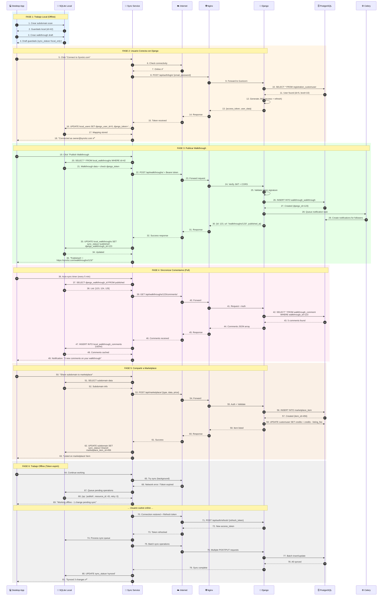
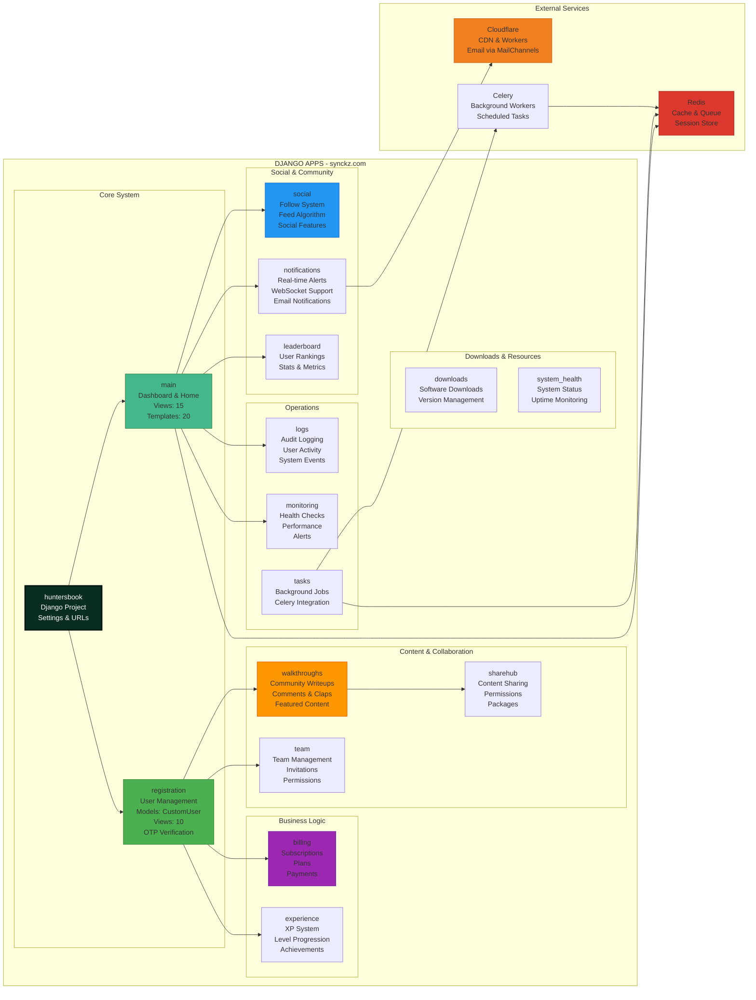

# 🌐 Arquitectura Completa del Sistema Synckz - Integración Desktop + Django

**Fecha:** 2025-10-06
**Proyecto:** Synckz Complete System
**Componentes:** Desktop App (Go + React) + Django Backend (synckz.com)

---

## 🏗️ DIAGRAMA MAESTRO: Sistema Completo Integrado

```mermaid
graph TB
    subgraph "👤 USUARIOS"
        DESKTOP_USER[Usuario Desktop App<br/>Trabajo Local]
        WEB_USER[Usuario Web<br/>Navegador]
    end

    subgraph "💻 SYNCKZ DESKTOP APPLICATION - LOCAL"
        subgraph "Frontend Layer :5177"
            UI[React UI Components]
            ROUTER[React Router]
            AUTH_UI[Auth UI]
            SYNC_UI[Sync Panel]
            WORKSPACE_UI[Workspace Manager]
            SUBDOMAIN_UI[Subdomain Scanner]
            WALKTHROUGH_UI[Walkthrough Editor]
            BOARD_UI[Kanban Board]
            DORK_UI[Dork Manager]
            CRED_UI[Credential Vault]
        end

        subgraph "Service Layer - TypeScript"
            LOCAL_AUTH_SVC[Local Auth Service]
            DJANGO_AUTH_SVC[Django Auth Service]
            SYNC_SVC[Sync Service]
            WORKSPACE_SVC[Workspace Service]
            SUBDOMAIN_SVC[Subdomain Service]
            WALKTHROUGH_SVC[Walkthrough Service]
        end

        subgraph "Go Microservices Backend"
            GO_AUTH["🔐 Auth Service<br/>:8081"]
            GO_WORKSPACE["📁 Workspace Service<br/>:8088"]
            GO_SUBDOMAIN["🌐 Subdomain Service<br/>:8082"]
            GO_PORT["🔍 Port Scanner<br/>:8080"]
            GO_DORK["🔎 Dork Service<br/>:8083"]
            GO_METHOD["📚 Methodology<br/>:8085"]
            GO_WALK["📝 Walkthrough<br/>:8087"]
            GO_BOARD["📋 Board Service<br/>:8086"]
            GO_CRED["🔒 Credential<br/>:8089"]
            GO_WORD["📖 Wordlist<br/>:8090"]
        end

        subgraph "Local Databases - SQLite"
            SQLITE_AUTH[(auth.db)]
            SQLITE_WORKSPACE[(workspaces.db)]
            SQLITE_SUBDOMAIN[(subdomains.db)]
            SQLITE_WALK[(walkthroughs.db)]
            SQLITE_CRED[(credentials.db)]
            SQLITE_BOARD[(boards.db)]
            SQLITE_DORK[(dorks.db)]
            SQLITE_METHOD[(methodologies.db)]
            SQLITE_WORD[(wordlists.db)]
        end
    end

    subgraph "☁️ INTERNET"
        INTERNET{Internet Connection<br/>HTTPS/WSS}
    end

    subgraph "🌐 SYNCKZ.COM - DJANGO BACKEND (PRODUCCIÓN)"
        subgraph "Web Server Stack"
            NGINX[Nginx Reverse Proxy<br/>:80/:443]
            GUNICORN[Gunicorn WSGI<br/>Workers: 4]
            SSL[SSL Certificate<br/>Let's Encrypt]
        end

        subgraph "Django Applications"
            subgraph "Core Apps"
                DJANGO_MAIN[main<br/>Dashboard, Home]
                DJANGO_REG[registration<br/>User Management]
                DJANGO_AUTH[Authentication<br/>Session + JWT]
            end

            subgraph "Social Features"
                DJANGO_SOCIAL[social<br/>Follow, Feed]
                DJANGO_NOTIF[notifications<br/>Real-time Alerts]
                DJANGO_LEAD[leaderboard<br/>Rankings]
            end

            subgraph "Content Apps"
                DJANGO_WALK[walkthroughs<br/>Community Writeups]
                DJANGO_TEAM[team<br/>Teams & Collaboration]
                DJANGO_SHARE[sharehub<br/>Sharing Content]
            end

            subgraph "Business Apps"
                DJANGO_BILLING[billing<br/>Plans & Subscriptions]
                DJANGO_EXP[experience<br/>XP & Levels]
                DJANGO_MARKET[marketplace<br/>Buy/Sell Data]
            end

            subgraph "System Apps"
                DJANGO_LOGS[logs<br/>Audit Logs]
                DJANGO_MONITOR[monitoring<br/>Health Checks]
                DJANGO_TASKS[tasks<br/>Background Jobs]
            end
        end

        subgraph "Django Middleware & Services"
            DJANGO_CORS[CORS Handler]
            DJANGO_JWT[JWT Auth Service]
            DJANGO_SESSION[Session Manager]
            DJANGO_CSRF[CSRF Protection]
            DJANGO_CACHE[Redis Cache]
        end

        subgraph "Database Layer"
            POSTGRES[(PostgreSQL<br/>huntersdb)]

            subgraph "Tables"
                TBL_USERS[registration_customuser]
                TBL_WALK[walkthrough_walkthrough]
                TBL_COMMENT[walkthrough_comment]
                TBL_TEAM[team_team]
                TBL_BILLING[billing_subscription]
                TBL_NOTIF[notifications_notification]
                TBL_SOCIAL[social_follow]
                TBL_MARKET[marketplace_item]
            end
        end

        subgraph "Static & Media Files"
            STATIC_FILES[Static Files<br/>/var/www/synckz/staticfiles/]
            MEDIA_FILES[Media Files<br/>/var/www/synckz/media/]
            CDN[Cloudflare CDN<br/>Optional]
        end

        subgraph "Background Services"
            CELERY[Celery Workers<br/>Async Tasks]
            REDIS_QUEUE[(Redis Queue)]
            CRON[Cron Jobs<br/>Scheduled Tasks]
        end
    end

    subgraph "🔗 API ENDPOINTS - Django REST"
        API_AUTH["/api/auth/login/<br/>/api/auth/register/<br/>/api/auth/refresh/"]
        API_USER["/api/user/profile/<br/>/api/user/stats/"]
        API_WALK["/api/walkthroughs/<br/>/api/walkthroughs/{id}/"]
        API_SYNC["/api/sync/push/<br/>/api/sync/pull/"]
        API_MARKET["/api/marketplace/<br/>/api/marketplace/{id}/"]
        API_TEAM["/api/teams/<br/>/api/teams/{id}/"]
    end

    %% ========== CONEXIONES DESKTOP APP ==========

    %% User to UI
    DESKTOP_USER --> UI

    %% UI to Components
    UI --> ROUTER
    ROUTER --> AUTH_UI
    ROUTER --> SYNC_UI
    ROUTER --> WORKSPACE_UI
    ROUTER --> SUBDOMAIN_UI
    ROUTER --> WALKTHROUGH_UI
    ROUTER --> BOARD_UI
    ROUTER --> DORK_UI
    ROUTER --> CRED_UI

    %% UI to Services
    AUTH_UI --> LOCAL_AUTH_SVC
    AUTH_UI --> DJANGO_AUTH_SVC
    SYNC_UI --> SYNC_SVC
    WORKSPACE_UI --> WORKSPACE_SVC
    SUBDOMAIN_UI --> SUBDOMAIN_SVC
    WALKTHROUGH_UI --> WALKTHROUGH_SVC

    %% Services to Go Microservices
    LOCAL_AUTH_SVC --> GO_AUTH
    WORKSPACE_SVC --> GO_WORKSPACE
    SUBDOMAIN_SVC --> GO_SUBDOMAIN
    SUBDOMAIN_SVC --> GO_PORT
    WALKTHROUGH_SVC --> GO_WALK

    %% Go Services to SQLite
    GO_AUTH --> SQLITE_AUTH
    GO_WORKSPACE --> SQLITE_WORKSPACE
    GO_SUBDOMAIN --> SQLITE_SUBDOMAIN
    GO_PORT --> SQLITE_SUBDOMAIN
    GO_WALK --> SQLITE_WALK
    GO_CRED --> SQLITE_CRED
    GO_BOARD --> SQLITE_BOARD
    GO_DORK --> SQLITE_DORK
    GO_METHOD --> SQLITE_METHOD
    GO_WORD --> SQLITE_WORD

    %% ========== SINCRONIZACIÓN CON DJANGO ==========

    %% Sync Service a Internet
    SYNC_SVC -.->|HTTPS/JWT| INTERNET
    DJANGO_AUTH_SVC -.->|HTTPS/JWT| INTERNET

    %% Internet a Django
    INTERNET -.-> NGINX
    NGINX --> SSL
    NGINX --> GUNICORN

    %% Gunicorn a Django Apps
    GUNICORN --> DJANGO_MAIN
    GUNICORN --> DJANGO_REG
    GUNICORN --> DJANGO_AUTH
    GUNICORN --> DJANGO_SOCIAL
    GUNICORN --> DJANGO_NOTIF
    GUNICORN --> DJANGO_WALK
    GUNICORN --> DJANGO_TEAM
    GUNICORN --> DJANGO_BILLING
    GUNICORN --> DJANGO_EXP
    GUNICORN --> DJANGO_MARKET
    GUNICORN --> DJANGO_LOGS
    GUNICORN --> DJANGO_MONITOR

    %% Django Middleware
    GUNICORN --> DJANGO_CORS
    GUNICORN --> DJANGO_JWT
    GUNICORN --> DJANGO_SESSION
    GUNICORN --> DJANGO_CSRF

    %% API Endpoints
    DJANGO_AUTH --> API_AUTH
    DJANGO_REG --> API_USER
    DJANGO_WALK --> API_WALK
    DJANGO_MAIN --> API_SYNC
    DJANGO_MARKET --> API_MARKET
    DJANGO_TEAM --> API_TEAM

    %% Django Apps to PostgreSQL
    DJANGO_REG --> POSTGRES
    DJANGO_WALK --> POSTGRES
    DJANGO_SOCIAL --> POSTGRES
    DJANGO_TEAM --> POSTGRES
    DJANGO_BILLING --> POSTGRES
    DJANGO_NOTIF --> POSTGRES
    DJANGO_MARKET --> POSTGRES
    DJANGO_LOGS --> POSTGRES

    %% PostgreSQL Tables
    POSTGRES --> TBL_USERS
    POSTGRES --> TBL_WALK
    POSTGRES --> TBL_COMMENT
    POSTGRES --> TBL_TEAM
    POSTGRES --> TBL_BILLING
    POSTGRES --> TBL_NOTIF
    POSTGRES --> TBL_SOCIAL
    POSTGRES --> TBL_MARKET

    %% Static Files
    DJANGO_MAIN --> STATIC_FILES
    DJANGO_REG --> MEDIA_FILES
    STATIC_FILES -.-> CDN
    MEDIA_FILES -.-> CDN

    %% Background Services
    DJANGO_NOTIF --> CELERY
    DJANGO_TASKS --> CELERY
    CELERY --> REDIS_QUEUE
    DJANGO_CACHE --> REDIS_QUEUE

    %% Cron Jobs
    CRON --> DJANGO_LOGS
    CRON --> DJANGO_MONITOR

    %% ========== WEB USERS ==========
    WEB_USER --> NGINX
    NGINX --> STATIC_FILES
    NGINX --> MEDIA_FILES

    %% ========== ESTILOS ==========
    style DESKTOP_USER fill:#4CAF50,stroke:#2E7D32,stroke-width:3px
    style WEB_USER fill:#2196F3,stroke:#1565C0,stroke-width:3px

    style UI fill:#FF9800,stroke:#E65100,stroke-width:2px
    style SYNC_SVC fill:#9C27B0,stroke:#6A1B9A,stroke-width:2px

    style GO_AUTH fill:#4CAF50,stroke:#2E7D32
    style GO_WORKSPACE fill:#2196F3,stroke:#1565C0
    style GO_SUBDOMAIN fill:#FF9800,stroke:#E65100
    style GO_PORT fill:#F44336,stroke:#C62828
    style GO_DORK fill:#9C27B0,stroke:#6A1B9A
    style GO_METHOD fill:#00BCD4,stroke:#006064
    style GO_WALK fill:#FFEB3B,stroke:#F57F17
    style GO_BOARD fill:#E91E63,stroke:#880E4F
    style GO_CRED fill:#F44336,stroke:#C62828
    style GO_WORD fill:#795548,stroke:#4E342E

    style POSTGRES fill:#336791,stroke:#1A3A52,stroke-width:3px
    style NGINX fill:#009639,stroke:#005522,stroke-width:2px
    style DJANGO_AUTH fill:#092E20,stroke:#051610,stroke-width:2px

    style INTERNET fill:#03A9F4,stroke:#01579B,stroke-width:3px
```

---

## 🔄 DIAGRAMA DE FLUJO: Sincronización Desktop ↔ Django

---

## 🗄️ DIAGRAMA DE DATOS: Mapeo SQLite ↔ PostgreSQL

```mermaid
erDiagram
    %% ============================================
    %% DESKTOP APP - SQLite LOCAL
    %% ============================================

    LOCAL_USER {
        int id PK "Auto-increment local"
        string username
        string email UK
        string hashed_password "bcrypt"
        int level "Default: 1"
        int credits "Default: 0"
        string user_type "free|pro|admin"
        datetime created_at
        int django_user_id FK "NULL si no sincronizado"
        string django_access_token "NULL si offline"
        string django_refresh_token "NULL si offline"
        datetime last_sync_at "NULL si nunca sincronizado"
    }

    LOCAL_WORKSPACE {
        int id PK
        int user_id FK
        string name
        string description
        string target_domain
        string status "active|archived"
        datetime created_at
        datetime updated_at
        string sync_status "local_only|synced|pending"
        int django_workspace_id "NULL"
    }

    LOCAL_SUBDOMAIN {
        int id PK
        int workspace_id FK
        string subdomain UK
        string ip_address
        int status_code
        string title
        string technologies "JSON array"
        string screenshot_path "local file"
        datetime discovered_at
        string sync_status "local_only|shared|pending"
        int marketplace_item_id "NULL si no compartido"
    }

    LOCAL_WALKTHROUGH {
        int id PK
        int user_id FK
        string title
        text content_markdown
        string difficulty "easy|medium|hard|expert"
        string tags "JSON array"
        string category
        datetime created_at
        datetime updated_at
        string status "draft|published|archived"
        string sync_status "local_only|published|pending"
        int django_walkthrough_id "NULL si no publicado"
        int views_local "Contador local"
        int claps_local "Contador local"
    }

    LOCAL_WALKTHROUGH_COMMENT {
        int id PK
        int walkthrough_id FK
        int django_comment_id FK "ID del comment en Django"
        int django_user_id FK "ID del autor en Django"
        string author_username "Cache"
        text content
        int claps
        datetime created_at
        datetime synced_at "Última vez que se actualizó desde Django"
    }

    LOCAL_CREDENTIAL {
        int id PK
        int workspace_id FK
        string service_name
        string username
        string encrypted_password "AES-256"
        string url
        string notes
        datetime created_at
        datetime updated_at
        boolean shared "false = NUNCA sincronizar"
        string encryption_key_id "Para rotación de keys"
    }

    LOCAL_SYNC_QUEUE {
        int id PK
        int user_id FK
        string operation "create|update|delete|publish"
        string resource_type "walkthrough|subdomain|workspace"
        int resource_id
        text payload_json "Datos a sincronizar"
        int retry_count "Default: 0"
        datetime created_at
        datetime last_attempt_at
        string error_message "NULL si no ha fallado"
    }

    %% ============================================
    %% DJANGO BACKEND - PostgreSQL
    %% ============================================

    DJANGO_CUSTOMUSER {
        int id PK
        string username UK
        string email UK
        string password "Django hash (PBKDF2)"
        string first_name
        string last_name
        int level "Default: 1"
        int credits "Default: 0"
        int experience "Default: 0"
        string role "Normal User|Admin|Moderator"
        string status "active|banned"
        string team "Nombre del team (nullable)"
        boolean is_staff
        boolean is_superuser
        boolean is_active
        boolean is_profile_public
        datetime date_joined
        datetime last_login
        datetime last_connection
        string profile_picture "URL to media file"
        int subdomains_found
        int subdomains_sold
        int payloads_shared
        decimal total_earnings
    }

    DJANGO_WALKTHROUGH {
        int id PK
        int author_id FK
        string title
        text content "Markdown"
        string difficulty
        string tags "JSON or comma-separated"
        string category
        int views "Contador global"
        int claps "Contador global"
        datetime published_at
        datetime updated_at
        boolean is_featured
        string status "draft|published|archived"
    }

    DJANGO_COMMENT {
        int id PK
        int walkthrough_id FK
        int user_id FK
        text content
        int claps
        datetime created_at
        datetime updated_at
        int parent_comment_id "NULL si no es reply"
    }

    DJANGO_TEAM {
        int id PK
        string name UK
        string description
        int master_id FK "Leader del team"
        datetime created_at
        datetime updated_at
    }

    DJANGO_TEAM_MEMBERSHIP {
        int id PK
        int team_id FK
        int user_id FK
        string position "master|member"
        datetime joined_at
    }

    DJANGO_MARKETPLACE_ITEM {
        int id PK
        int seller_id FK
        string item_type "subdomain|wordlist|methodology|tool"
        string title
        text description
        int price_credits
        jsonb data "Datos del item"
        datetime listed_at
        datetime sold_at
        int buyer_id FK "NULL si no vendido"
        boolean is_sold
        boolean is_featured
    }

    DJANGO_NOTIFICATION {
        int id PK
        int user_id FK
        string notification_type "comment|clap|follow|mention"
        text message
        jsonb metadata "Datos extra"
        boolean is_read
        datetime created_at
        datetime read_at
    }

    DJANGO_FOLLOW {
        int id PK
        int follower_id FK
        int following_id FK
        datetime created_at
    }

    DJANGO_SUBSCRIPTION {
        int id PK
        int user_id FK
        int plan_id FK
        string status "active|cancelled|expired"
        datetime start_date
        datetime end_date
        datetime cancelled_at
    }

    DJANGO_SYNC_LOG {
        int id PK
        int user_id FK
        string operation "push|pull"
        string resource_type
        int resource_id_local "ID en desktop app"
        int resource_id_django "ID en PostgreSQL"
        boolean success
        text error_message
        datetime synced_at
    }

    %% ============================================
    %% RELACIONES LOCALES (SQLite)
    %% ============================================

    LOCAL_USER ||--o{ LOCAL_WORKSPACE : "owns"
    LOCAL_USER ||--o{ LOCAL_WALKTHROUGH : "creates"
    LOCAL_USER ||--o{ LOCAL_SYNC_QUEUE : "has pending"
    LOCAL_WORKSPACE ||--o{ LOCAL_SUBDOMAIN : "contains"
    LOCAL_WORKSPACE ||--o{ LOCAL_CREDENTIAL : "stores"
    LOCAL_WALKTHROUGH ||--o{ LOCAL_WALKTHROUGH_COMMENT : "has (cache)"

    %% ============================================
    %% RELACIONES DJANGO (PostgreSQL)
    %% ============================================

    DJANGO_CUSTOMUSER ||--o{ DJANGO_WALKTHROUGH : "authors"
    DJANGO_CUSTOMUSER ||--o{ DJANGO_COMMENT : "writes"
    DJANGO_CUSTOMUSER ||--o{ DJANGO_MARKETPLACE_ITEM : "sells"
    DJANGO_CUSTOMUSER ||--o{ DJANGO_MARKETPLACE_ITEM : "buys"
    DJANGO_CUSTOMUSER ||--o{ DJANGO_NOTIFICATION : "receives"
    DJANGO_CUSTOMUSER ||--o{ DJANGO_FOLLOW : "follows (follower)"
    DJANGO_CUSTOMUSER ||--o{ DJANGO_FOLLOW : "followed by (following)"
    DJANGO_CUSTOMUSER ||--o{ DJANGO_SUBSCRIPTION : "has"
    DJANGO_CUSTOMUSER ||--o{ DJANGO_SYNC_LOG : "syncs"
    DJANGO_CUSTOMUSER ||--o{ DJANGO_TEAM_MEMBERSHIP : "member of"

    DJANGO_WALKTHROUGH ||--o{ DJANGO_COMMENT : "has comments"
    DJANGO_TEAM ||--o{ DJANGO_TEAM_MEMBERSHIP : "contains members"

    %% ============================================
    %% SINCRONIZACIÓN CROSS-DATABASE
    %% ============================================

    LOCAL_USER }o--|| DJANGO_CUSTOMUSER : "django_user_id (FK virtual)"
    LOCAL_WALKTHROUGH }o--|| DJANGO_WALKTHROUGH : "django_walkthrough_id (FK virtual)"
    LOCAL_WALKTHROUGH_COMMENT }o--|| DJANGO_COMMENT : "django_comment_id (FK virtual)"
    LOCAL_SUBDOMAIN }o--|| DJANGO_MARKETPLACE_ITEM : "marketplace_item_id (FK virtual)"
```

---

## 📊 DIAGRAMA: Apps de Django Real (Actual)

---

## 🔄 RESUMEN DE INTEGRACIÓN

### **Desktop App (Local)**
- **Tecnología**: React + TypeScript + Go Microservices
- **Base de datos**: SQLite (9 archivos .db separados)
- **Puertos**: 8080-8090 (Go services), 5177 (Frontend)
- **Funcionalidad**: 100% offline, sincronización opcional

### **Django Backend (synckz.com)**
- **Apps Django**: 15 apps (main, registration, social, walkthroughs, billing, etc.)
- **Base de datos**: PostgreSQL (huntersdb)
- **Servidor**: Nginx + Gunicorn
- **Funcionalidad**: Comunidad, compartir, marketplace, social features

### **Puntos de Integración**
1. **Autenticación**: JWT tokens desde Django → almacenados en SQLite
2. **Walkthroughs**: Publicar desde desktop → PostgreSQL
3. **Comentarios**: Pull desde Django → caché en SQLite
4. **Marketplace**: Compartir subdominios → PostgreSQL marketplace_item
5. **Perfil**: Sincronizar level/credits bidireccional
6. **Teams**: Opcional - sincronizar membresías

### **Datos que SE sincronizan**
- ✅ Walkthroughs publicados
- ✅ Comentarios (pull only - read-only cache)
- ✅ Perfil de usuario (level, credits, avatar)
- ✅ Marketplace items
- ✅ Notificaciones (pull only)

### **Datos que NO se sincronizan (privados)**
- ❌ Subdominios (a menos que usuario los comparta)
- ❌ Credenciales (NUNCA salen de la máquina)
- ❌ Port scans
- ❌ Notas privadas
- ❌ Walkthroughs en draft

---

¿Te gustaría que agregue más diagramas específicos o profundice en algún aspecto de la integración?
