# 🏗️ Arquitectura Híbrida Synckz - Diagramas Detallados

## 📊 Diagrama 1: Arquitectura General del Sistema

```mermaid
graph TB
    subgraph "USUARIO"
        U[👤 Usuario]
    end

    subgraph "SYNCKZ DESKTOP APP - LOCAL"
        subgraph "Frontend - React/TypeScript"
            UI[🎨 UI Components]
            AUTH_UI[🔐 Auth UI]
            SYNC_UI[🔄 Sync Panel]
            WORKSPACE_UI[📁 Workspace UI]
            WALKTHROUGH_UI[📚 Walkthrough Editor]
            SUBDOMAIN_UI[🌐 Subdomain Scanner]
        end

        subgraph "Services Layer"
            LOCAL_AUTH[Local Auth Service]
            DJANGO_AUTH[Django Auth Service]
            SYNC_SERVICE[Sync Service]
            WORKSPACE_SERVICE[Workspace Service]
            SUBDOMAIN_SERVICE[Subdomain Service]
            WALKTHROUGH_SERVICE[Walkthrough Service]
        end

        subgraph "Local Storage - SQLite"
            LOCAL_DB[(SQLite DB)]
            LOCAL_USERS[Users Table]
            LOCAL_WORKSPACES[Workspaces]
            LOCAL_SUBDOMAINS[Subdomains]
            LOCAL_WALKTHROUGHS[Walkthroughs]
            LOCAL_CREDENTIALS[Credentials]
            SYNC_STATUS[Sync Status]
        end

        subgraph "Go Microservices - Backend Local"
            GO_AUTH[Go Auth Service :8081]
            GO_SUBDOMAIN[Go Subdomain Service :8082]
            GO_DORK[Go Dork Service :8083]
            GO_PORT[Go Port Scanner :8080]
            GO_METHODOLOGY[Go Methodology :8085]
            GO_BOARD[Go Board Service :8086]
            GO_WALKTHROUGH[Go Walkthrough :8087]
            GO_WORKSPACE[Go Workspace :8088]
            GO_CREDENTIAL[Go Credential :8089]
            GO_WORDLIST[Go Wordlist :8090]
        end
    end

    subgraph "INTERNET"
        INTERNET{☁️ Internet Connection}
    end

    subgraph "SYNCKZ.COM - DJANGO BACKEND"
        subgraph "Django API Layer"
            DJANGO_API[🌐 Django REST API]
            DJANGO_AUTH_EP[/api/auth/login/]
            DJANGO_PROFILE_EP[/api/user/profile/]
            DJANGO_WALKTHROUGH_EP[/api/walkthroughs/]
            DJANGO_SYNC_EP[/api/sync/]
            DJANGO_MARKETPLACE_EP[/api/marketplace/]
        end

        subgraph "Django Services"
            DJANGO_AUTH_SRV[Authentication Service]
            DJANGO_USER_SRV[User Service]
            DJANGO_SOCIAL_SRV[Social Service]
            DJANGO_MARKETPLACE_SRV[Marketplace Service]
        end

        subgraph "PostgreSQL Database"
            POSTGRES_DB[(PostgreSQL)]
            DJANGO_USERS[CustomUser]
            DJANGO_WALKTHROUGHS[Published Walkthroughs]
            DJANGO_COMMENTS[Comments]
            DJANGO_MARKETPLACE[Marketplace Items]
            DJANGO_TEAMS[Teams]
        end

        subgraph "Static Files"
            MEDIA[Media Files]
            STATIC[Static Assets]
        end
    end

    subgraph "WEB USERS"
        WEB_USER[🌐 Web Browser Users]
    end

    %% User interactions
    U -->|Usa app localmente| UI
    U -->|Opcional: Connect| SYNC_UI

    %% UI to Services
    UI --> LOCAL_AUTH
    UI --> WORKSPACE_SERVICE
    UI --> SUBDOMAIN_SERVICE
    UI --> WALKTHROUGH_SERVICE

    AUTH_UI --> LOCAL_AUTH
    AUTH_UI --> DJANGO_AUTH
    SYNC_UI --> SYNC_SERVICE

    %% Services to Go Microservices
    LOCAL_AUTH --> GO_AUTH
    WORKSPACE_SERVICE --> GO_WORKSPACE
    SUBDOMAIN_SERVICE --> GO_SUBDOMAIN
    WALKTHROUGH_SERVICE --> GO_WALKTHROUGH

    %% Go Services to Local DB
    GO_AUTH --> LOCAL_DB
    GO_WORKSPACE --> LOCAL_DB
    GO_SUBDOMAIN --> LOCAL_DB
    GO_WALKTHROUGH --> LOCAL_DB
    GO_CREDENTIAL --> LOCAL_DB
    GO_WORDLIST --> LOCAL_DB

    %% Local DB Tables
    LOCAL_DB --> LOCAL_USERS
    LOCAL_DB --> LOCAL_WORKSPACES
    LOCAL_DB --> LOCAL_SUBDOMAINS
    LOCAL_DB --> LOCAL_WALKTHROUGHS
    LOCAL_DB --> LOCAL_CREDENTIALS
    LOCAL_DB --> SYNC_STATUS

    %% Sync Service
    SYNC_SERVICE -.->|Opcional| INTERNET
    INTERNET -.-> DJANGO_API

    %% Django Auth
    DJANGO_AUTH -->|JWT Token| DJANGO_API
    DJANGO_API --> DJANGO_AUTH_EP
    DJANGO_API --> DJANGO_PROFILE_EP
    DJANGO_API --> DJANGO_WALKTHROUGH_EP
    DJANGO_API --> DJANGO_SYNC_EP
    DJANGO_API --> DJANGO_MARKETPLACE_EP

    %% Django Services
    DJANGO_AUTH_EP --> DJANGO_AUTH_SRV
    DJANGO_PROFILE_EP --> DJANGO_USER_SRV
    DJANGO_WALKTHROUGH_EP --> DJANGO_SOCIAL_SRV
    DJANGO_MARKETPLACE_EP --> DJANGO_MARKETPLACE_SRV

    %% Django to PostgreSQL
    DJANGO_AUTH_SRV --> POSTGRES_DB
    DJANGO_USER_SRV --> POSTGRES_DB
    DJANGO_SOCIAL_SRV --> POSTGRES_DB
    DJANGO_MARKETPLACE_SRV --> POSTGRES_DB

    POSTGRES_DB --> DJANGO_USERS
    POSTGRES_DB --> DJANGO_WALKTHROUGHS
    POSTGRES_DB --> DJANGO_COMMENTS
    POSTGRES_DB --> DJANGO_MARKETPLACE

    %% Web users
    WEB_USER -->|Browse community| DJANGO_API

    style U fill:#4CAF50
    style INTERNET fill:#2196F3
    style LOCAL_DB fill:#FFC107
    style POSTGRES_DB fill:#9C27B0
    style DJANGO_API fill:#FF5722
```

---

## 🔄 Diagrama 2: Flujo de Autenticación Dual

```mermaid
sequenceDiagram
    participant User as 👤 Usuario
    participant UI as 🎨 Desktop UI
    participant LocalAuth as 🔐 Local Auth Service
    participant GoAuth as Go Auth :8081
    participant LocalDB as 💾 SQLite Local
    participant DjangoAuth as ☁️ Django Auth Service
    participant SyncService as 🔄 Sync Service
    participant DjangoAPI as 🌐 Django API
    participant PostgreSQL as 🗄️ PostgreSQL

    rect rgb(200, 220, 240)
        Note over User,LocalDB: MODO 1: Autenticación Local (Offline)
        User->>UI: 1. Abre la app (primera vez)
        UI->>LocalAuth: 2. Check existing session
        LocalAuth->>LocalDB: 3. Query local users
        LocalDB-->>LocalAuth: 4. No users found
        UI->>User: 5. Show "Create Local Account"
        User->>UI: 6. Enter username/password
        UI->>LocalAuth: 7. createLocalUser(credentials)
        LocalAuth->>GoAuth: 8. POST /auth/register
        GoAuth->>LocalDB: 9. Hash password + Store user
        LocalDB-->>GoAuth: 10. User created (id: 1)
        GoAuth-->>LocalAuth: 11. JWT token (local)
        LocalAuth->>UI: 12. User logged in ✅
        UI->>User: 13. Show Dashboard (100% local)
    end

    rect rgb(220, 240, 200)
        Note over User,PostgreSQL: MODO 2: Login con Django (Online - Opcional)
        User->>UI: 14. Click "Connect to Synckz.com"
        UI->>SyncService: 15. showDjangoLogin()
        SyncService->>User: 16. Show Django login modal
        User->>SyncService: 17. Enter email/password
        SyncService->>DjangoAPI: 18. POST /api/auth/login/
        DjangoAPI->>DjangoAuth: 19. Authenticate user
        DjangoAuth->>PostgreSQL: 20. Query CustomUser
        PostgreSQL-->>DjangoAuth: 21. User found + verified
        DjangoAuth->>DjangoAPI: 22. Generate JWT token
        DjangoAPI-->>SyncService: 23. {access_token, user_data}
        SyncService->>LocalDB: 24. Store Django token + user_id mapping
        SyncService->>UI: 25. Update sync status: "Connected ✅"
        UI->>User: 26. Show sync options
    end

    rect rgb(240, 220, 200)
        Note over User,PostgreSQL: MODO 3: Dual Mode (Híbrido)
        User->>UI: 27. Working with local data
        UI->>LocalDB: 28. Save subdomain scan results
        LocalDB-->>UI: 29. Data saved locally ✅
        User->>UI: 30. Click "Publish to Community"
        UI->>SyncService: 31. publishWalkthrough(id)
        SyncService->>LocalDB: 32. Check Django connection
        LocalDB-->>SyncService: 33. Token valid, user_id mapped
        SyncService->>DjangoAPI: 34. POST /api/walkthroughs/ + Bearer token
        DjangoAPI->>PostgreSQL: 35. Insert walkthrough
        PostgreSQL-->>DjangoAPI: 36. Created (django_id: 123)
        DjangoAPI-->>SyncService: 37. {id: 123, published: true}
        SyncService->>LocalDB: 38. Update sync_status + django_id
        LocalDB-->>SyncService: 39. Updated ✅
        SyncService->>UI: 40. "Published to community! 🎉"
        UI->>User: 41. Show success + community link
    end
```



---

## 🗄️ Diagrama 3: Estructura de Bases de Datos

```mermaid
erDiagram
    %% ============ LOCAL DATABASE (SQLite) ============
    LOCAL_USER {
        int id PK
        string username
        string email
        string hashed_password
        int level
        int credits
        string user_type
        datetime created_at
        int django_user_id FK "NULL si no está sincronizado"
        string django_access_token "NULL si no conectado"
        string django_refresh_token
    }

    LOCAL_WORKSPACE {
        int id PK
        int user_id FK
        string name
        string description
        string target_domain
        datetime created_at
        string sync_status "pending|synced|local_only"
        int django_workspace_id "NULL si no sincronizado"
    }

    LOCAL_SUBDOMAIN {
        int id PK
        int workspace_id FK
        string subdomain
        string ip_address
        int status_code
        string title
        string technologies
        datetime discovered_at
        string sync_status "local_only|shared|pending"
        int django_subdomain_id
    }

    LOCAL_WALKTHROUGH {
        int id PK
        int user_id FK
        string title
        text content_markdown
        string difficulty
        string tags
        datetime created_at
        datetime updated_at
        string status "draft|published|archived"
        string sync_status "local_only|published|pending"
        int django_walkthrough_id
    }

    LOCAL_CREDENTIAL {
        int id PK
        int workspace_id FK
        string service_name
        string username
        string encrypted_password
        string url
        datetime created_at
        boolean shared "false = never sync"
    }

    LOCAL_PORT_SCAN {
        int id PK
        int workspace_id FK
        string target_ip
        int port
        string service
        string version
        datetime scanned_at
    }

    LOCAL_SYNC_LOG {
        int id PK
        int user_id FK
        string resource_type
        int resource_id
        string action "push|pull"
        datetime synced_at
        boolean success
        text error_message
    }

    %% ============ DJANGO DATABASE (PostgreSQL) ============
    DJANGO_CUSTOMUSER {
        int id PK
        string username
        string email UK
        string password
        string first_name
        string last_name
        int level
        int credits
        string role
        string status
        string team
        boolean is_staff
        boolean is_superuser
        boolean is_active
        datetime date_joined
        datetime last_login
        datetime last_connection
        string profile_picture
    }

    DJANGO_WALKTHROUGH {
        int id PK
        int author_id FK
        string title
        text content
        string difficulty
        string tags
        int views
        int claps
        datetime published_at
        datetime updated_at
        boolean is_featured
        string status
    }

    DJANGO_COMMENT {
        int id PK
        int walkthrough_id FK
        int user_id FK
        text content
        int claps
        datetime created_at
        int parent_comment_id
    }

    DJANGO_MARKETPLACE_ITEM {
        int id PK
        int seller_id FK
        string item_type "subdomain|wordlist|methodology"
        string title
        text description
        int price_credits
        json data
        datetime listed_at
        boolean is_sold
    }

    DJANGO_TEAM {
        int id PK
        string name
        string description
        int master_id FK
        datetime created_at
    }

    DJANGO_TEAM_MEMBERSHIP {
        int id PK
        int team_id FK
        int user_id FK
        string position "master|member"
        datetime joined_at
    }

    DJANGO_SYNC_TOKEN {
        int id PK
        int user_id FK
        string resource_type
        string last_sync_token
        datetime last_synced_at
    }

    %% ============ RELACIONES LOCALES ============
    LOCAL_USER ||--o{ LOCAL_WORKSPACE : "owns"
    LOCAL_USER ||--o{ LOCAL_WALKTHROUGH : "creates"
    LOCAL_WORKSPACE ||--o{ LOCAL_SUBDOMAIN : "contains"
    LOCAL_WORKSPACE ||--o{ LOCAL_CREDENTIAL : "stores"
    LOCAL_WORKSPACE ||--o{ LOCAL_PORT_SCAN : "has"
    LOCAL_USER ||--o{ LOCAL_SYNC_LOG : "performs"

    %% ============ RELACIONES DJANGO ============
    DJANGO_CUSTOMUSER ||--o{ DJANGO_WALKTHROUGH : "authors"
    DJANGO_CUSTOMUSER ||--o{ DJANGO_COMMENT : "writes"
    DJANGO_CUSTOMUSER ||--o{ DJANGO_MARKETPLACE_ITEM : "sells"
    DJANGO_CUSTOMUSER ||--o{ DJANGO_TEAM_MEMBERSHIP : "joins"
    DJANGO_WALKTHROUGH ||--o{ DJANGO_COMMENT : "has"
    DJANGO_TEAM ||--o{ DJANGO_TEAM_MEMBERSHIP : "contains"
    DJANGO_CUSTOMUSER ||--o{ DJANGO_SYNC_TOKEN : "has"

    %% ============ SINCRONIZACIÓN CROSS-DB ============
    LOCAL_USER }o--|| DJANGO_CUSTOMUSER : "syncs via django_user_id"
    LOCAL_WALKTHROUGH }o--|| DJANGO_WALKTHROUGH : "syncs via django_walkthrough_id"
```



---

## 🔄 Diagrama 4: Flujo de Sincronización de Walkthroughs


---

## 🏢 Diagrama 5: Arquitectura de Microservicios Go


---

## 🌐 Diagrama 6: Sincronización Selectiva de Datos

```mermaid
flowchart TD
    Start([Usuario trabaja localmente]) --> CreateData{Tipo de dato creado}

    CreateData -->|Subdomain scan| SubdomainLocal[Guardar en SQLite local]
    CreateData -->|Port scan| PortLocal[Guardar en SQLite local]
    CreateData -->|Credential| CredentialLocal[🔒 Guardar encriptado localmente]
    CreateData -->|Walkthrough| WalkthroughLocal[Guardar borrador local]
    CreateData -->|Note| NoteLocal[Guardar nota privada]

    SubdomainLocal --> SubdomainDecision{Usuario decide}
    PortLocal --> PortDecision{Usuario decide}
    CredentialLocal --> CredentialDecision{Usuario decide}
    WalkthroughLocal --> WalkthroughDecision{Usuario decide}
    NoteLocal --> NoteDecision{Usuario decide}

    %% Subdomain flow
    SubdomainDecision -->|Keep private| StayLocal1[❌ Nunca sincroniza]
    SubdomainDecision -->|Share to marketplace| CheckAuth1{Conectado a Django?}
    CheckAuth1 -->|No| DjangoLogin1[Solicitar login Django]
    CheckAuth1 -->|Yes| UploadSubdomain[📤 POST /api/marketplace/]
    DjangoLogin1 --> UploadSubdomain
    UploadSubdomain --> MarkSynced1[Actualizar sync_status en SQLite]
    MarkSynced1 --> SubdomainPublic[✅ Disponible en marketplace]

    %% Port scan flow
    PortDecision -->|Keep private| StayLocal2[❌ Nunca sincroniza]
    PortDecision -->|Share results| CheckAuth2{Conectado a Django?}
    CheckAuth2 -->|No| DjangoLogin2[Solicitar login Django]
    CheckAuth2 -->|Yes| UploadPortScan[📤 POST /api/port-scans/]
    DjangoLogin2 --> UploadPortScan
    UploadPortScan --> MarkSynced2[Actualizar sync_status en SQLite]

    %% Credential flow
    CredentialDecision -->|🔒 Always private| StayLocal3[❌ NUNCA sale de la máquina]
    CredentialDecision -->|Team share| TeamOnly[📤 Compartir solo con team]
    TeamOnly --> EncryptedShare[Compartir encriptado end-to-end]

    %% Walkthrough flow
    WalkthroughDecision -->|Keep as draft| StayLocal4[❌ Solo local]
    WalkthroughDecision -->|Publish to community| CheckAuth3{Conectado a Django?}
    CheckAuth3 -->|No| DjangoLogin3[Solicitar login Django]
    CheckAuth3 -->|Yes| UploadWalkthrough[📤 POST /api/walkthroughs/]
    DjangoLogin3 --> UploadWalkthrough
    UploadWalkthrough --> MarkSynced3[Actualizar sync_status + django_id]
    MarkSynced3 --> WalkthroughPublic[✅ Publicado en synckz.com]
    WalkthroughPublic --> ReceiveInteractions[Recibir comentarios/claps]
    ReceiveInteractions --> PullUpdates[🔄 Sync service pull updates]
    PullUpdates --> UpdateLocalCache[Actualizar cache local]

    %% Note flow
    NoteDecision -->|Private| StayLocal5[❌ Solo local]
    NoteDecision -->|Backup to cloud| BackupNote[☁️ Backup opcional]
    BackupNote --> EncryptedBackup[Backup encriptado]

    %% End states
    StayLocal1 --> End1([Dato permanece 100% local])
    StayLocal2 --> End1
    StayLocal3 --> End1
    StayLocal4 --> End1
    StayLocal5 --> End1
    SubdomainPublic --> End2([Dato sincronizado y público])
    UpdateLocalCache --> End2
    EncryptedShare --> End3([Dato compartido selectivamente])
    EncryptedBackup --> End3

    style StayLocal1 fill:#4CAF50
    style StayLocal2 fill:#4CAF50
    style StayLocal3 fill:#F44336,color:#fff
    style StayLocal4 fill:#4CAF50
    style StayLocal5 fill:#4CAF50
    style SubdomainPublic fill:#2196F3
    style WalkthroughPublic fill:#2196F3
    style EncryptedShare fill:#FF9800
```



---

## 🔐 Diagrama 7: Flujo de Seguridad y Tokens


---

## 📱 Diagrama 8: Componentes de UI y sus Estados


---

## ⚙️ Diagrama 9: Configuración de Entorno

```mermaid
graph TB
    subgraph "DESARROLLO LOCAL"
        subgraph "Frontend Development"
            VITE[Vite Dev Server :5177]
            REACT[React Hot Reload]
            TYPESCRIPT[TypeScript Compiler]
        end

        subgraph "Go Services (Local)"
            GO_SERVICES[10 Go Microservices<br/>Ports: 8080-8090]
            GO_ENV[.env.local<br/>JWT_SECRET=shared_jwt_secret_for_testing_123]
        end

        subgraph "Local Databases"
            SQLITE_FILES[SQLite Files<br/>~/.synckz/data/*.db]
            SQLITE_AUTH[auth.db]
            SQLITE_WORKSPACE[workspaces.db]
            SQLITE_SUBDOMAINS[subdomains.db]
            SQLITE_WALKTHROUGHS[walkthroughs.db]
        end

        VITE --> GO_SERVICES
        GO_SERVICES --> GO_ENV
        GO_SERVICES --> SQLITE_FILES
        SQLITE_FILES --> SQLITE_AUTH
        SQLITE_FILES --> SQLITE_WORKSPACE
        SQLITE_FILES --> SQLITE_SUBDOMAINS
        SQLITE_FILES --> SQLITE_WALKTHROUGHS
    end

    subgraph "PRODUCCIÓN - DJANGO (synckz.com)"
        subgraph "Django Configuration"
            DJANGO_PROD[Django Production]
            DJANGO_ENV[Environment Variables<br/>DEBUG=False<br/>ALLOWED_HOSTS=synckz.com]
            DJANGO_CORS[CORS Configuration<br/>CORS_ALLOWED_ORIGINS]
        end

        subgraph "Database"
            POSTGRES[PostgreSQL :5432<br/>Database: huntersdb]
        end

        subgraph "Web Server"
            NGINX[Nginx Reverse Proxy]
            GUNICORN[Gunicorn WSGI]
            SSL[SSL Certificate<br/>Let's Encrypt]
        end

        NGINX --> SSL
        NGINX --> GUNICORN
        GUNICORN --> DJANGO_PROD
        DJANGO_PROD --> DJANGO_ENV
        DJANGO_PROD --> DJANGO_CORS
        DJANGO_PROD --> POSTGRES
    end

    subgraph "APLICACIÓN COMPILADA (Distribución)"
        subgraph "Desktop Executable"
            EXE[synckz.exe / synckz.app<br/>Electron/Tauri Package]
            EMBEDDED_GO[Embedded Go Services<br/>(Binarios compilados)]
            EMBEDDED_FRONTEND[Embedded Frontend<br/>(Build optimizado)]
            EMBEDDED_SQLITE[Embedded SQLite<br/>(Base de datos portátil)]
        end

        EXE --> EMBEDDED_GO
        EXE --> EMBEDDED_FRONTEND
        EXE --> EMBEDDED_SQLITE
    end

    subgraph "CONFIGURACIÓN DEL USUARIO"
        subgraph "User Data Directory"
            USER_DIR[Windows: %APPDATA%/Synckz<br/>macOS: ~/Library/Application Support/Synckz<br/>Linux: ~/.config/synckz]
            USER_SETTINGS[settings.json<br/>Preferencias del usuario]
            USER_DATABASES[*.db SQLite files<br/>Datos locales del usuario]
            USER_LOGS[logs/<br/>Archivos de log]
            USER_CACHE[cache/<br/>Caché temporal]
        end

        USER_DIR --> USER_SETTINGS
        USER_DIR --> USER_DATABASES
        USER_DIR --> USER_LOGS
        USER_DIR --> USER_CACHE
    end

    %% Conexiones entre entornos
    VITE -.->|Desarrollo| DJANGO_PROD
    EXE -.->|Producción| DJANGO_PROD
    EXE --> USER_DIR

    %% Variables de entorno compartidas
    ENV_SHARED{Variables de Entorno Compartidas}
    ENV_SHARED --> GO_ENV
    ENV_SHARED --> DJANGO_ENV

    ENV_SHARED -.->|JWT_SECRET| GO_SERVICES
    ENV_SHARED -.->|DJANGO_API_URL| VITE
    ENV_SHARED -.->|CORS_ALLOWED_ORIGINS| DJANGO_CORS

    style VITE fill:#41B883
    style DJANGO_PROD fill:#092E20
    style EXE fill:#2196F3
    style POSTGRES fill:#336791
    style NGINX fill:#009639
```

---

## 🔄 Diagrama 10: Resolución de Conflictos

```mermaid
flowchart TD
    Start([Usuario edita walkthrough publicado]) --> CheckLocalChanges{Hay cambios locales?}

    CheckLocalChanges -->|No| NoConflict1[No hay conflicto]
    CheckLocalChanges -->|Yes| FetchRemote[Fetch datos de Django]

    FetchRemote --> CompareTimestamps{Comparar timestamps}

    CompareTimestamps -->|Local más reciente| LocalNewer[Local updated_at > Django updated_at]
    CompareTimestamps -->|Django más reciente| RemoteNewer[Django updated_at > Local updated_at]
    CompareTimestamps -->|Mismo timestamp| NoConflict2[No hay conflicto]

    LocalNewer --> PushToRemote[Push cambios locales a Django]
    PushToRemote --> UpdateSuccess{Push exitoso?}
    UpdateSuccess -->|Yes| UpdateLocalTimestamp[Actualizar timestamp local]
    UpdateSuccess -->|No| PushError[Error de red/auth]
    PushError --> QueueForRetry[Agregar a cola de retry]

    RemoteNewer --> CheckLocalModified{Usuario modificó local?}
    CheckLocalModified -->|No| PullFromRemote[Pull cambios de Django]
    CheckLocalModified -->|Yes| ConflictDetected[⚠️ CONFLICTO DETECTADO]

    ConflictDetected --> ShowConflictUI[Mostrar UI de resolución]

    ShowConflictUI --> UserChoice{Usuario elige}
    UserChoice -->|Keep local| KeepLocal[Mantener versión local]
    UserChoice -->|Use remote| UseRemote[Usar versión de Django]
    UserChoice -->|Merge manually| ManualMerge[Abrir editor de merge]

    KeepLocal --> ConfirmOverwrite{Confirmar sobrescribir Django?}
    ConfirmOverwrite -->|Yes| ForcePush[Force push a Django]
    ConfirmOverwrite -->|No| ShowConflictUI
    ForceP ush --> LogConflictResolution[Log: local_version_chosen]

    UseRemote --> ConfirmDiscard{Confirmar descartar cambios locales?}
    ConfirmDiscard -->|Yes| DiscardLocal[Sobrescribir local con Django]
    ConfirmDiscard -->|No| ShowConflictUI
    DiscardLocal --> LogConflictResolution2[Log: remote_version_chosen]

    ManualMerge --> ShowMergeEditor[Mostrar editor lado a lado]
    ShowMergeEditor --> UserMerges[Usuario combina manualmente]
    UserMerges --> SaveMerged[Guardar versión fusionada]
    SaveMerged --> PushMerged[Push versión fusionada]
    PushMerged --> LogConflictResolution3[Log: manual_merge]

    PullFromRemote --> UpdateLocalData[Actualizar SQLite local]
    UpdateLocalData --> NotifyUser1[Notificar: "Walkthrough actualizado desde comunidad"]

    UpdateLocalTimestamp --> NotifyUser2[Notificar: "Cambios publicados"]

    NoConflict1 --> End1([Sin acción requerida])
    NoConflict2 --> End1
    QueueForRetry --> End2([Reintentará más tarde])
    LogConflictResolution --> End3([Conflicto resuelto])
    LogConflictResolution2 --> End3
    LogConflictResolution3 --> End3
    NotifyUser1 --> End3
    NotifyUser2 --> End3

    style ConflictDetected fill:#FF5722,color:#fff
    style ShowConflictUI fill:#FF9800
    style ManualMerge fill:#FFC107
    style KeepLocal fill:#4CAF50
    style UseRemote fill:#2196F3
```

---

## 📊 RESUMEN DE COMPONENTES

### **Desktop App (Local)**
- **Frontend**: React + TypeScript (puerto 5177)
- **Backend**: 10 microservicios Go (puertos 8080-8090)
- **Base de datos**: SQLite (archivos locales)
- **Funciona**: 100% offline, sincronización opcional

### **Django Backend (synckz.com)**
- **API**: Django REST Framework + JWT
- **Base de datos**: PostgreSQL
- **Servicios**: Auth, Social, Marketplace, Teams
- **Propósito**: Comunidad, compartir datos, backup

### **Sincronización**
- **Modo**: Híbrido (local-first con sync opcional)
- **Datos privados**: NUNCA salen de la máquina
- **Datos públicos**: Usuario decide qué compartir
- **Conflictos**: Resolución manual con UI intuitiva

---

¿Te gustaría que profundice en algún diagrama específico o genere diagramas adicionales para otros aspectos del sistema?
